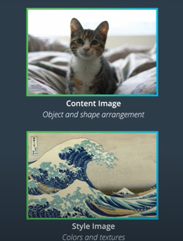
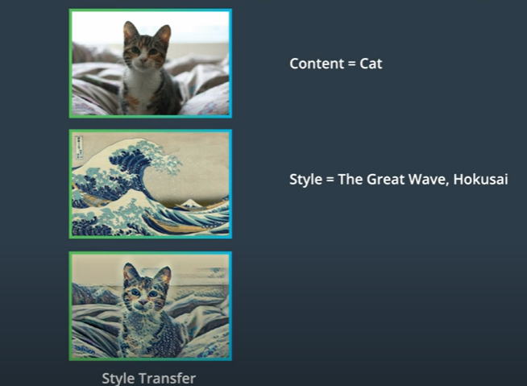
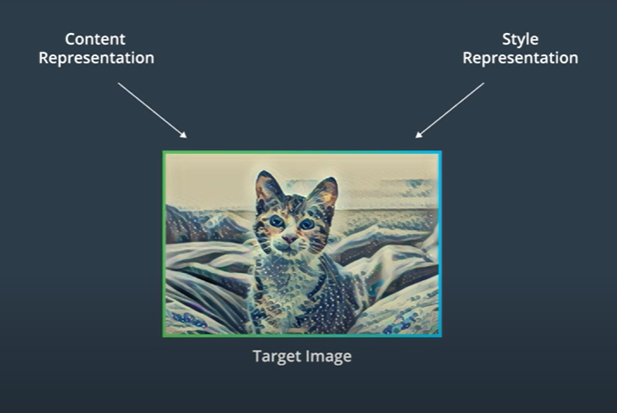

This repository is a rebuilding of a style transfer method that is outlined in this paper, [Image Style Transfer Using Convolutional Neural Networks, by Gays](https://www.cv-foundation.org/openaccess/content_cvpr_2016/papers/Gatys_Image_Style_Transfer_CVPR_2016_paper.pdf) in PyTorch.

## What is Style Transfer?

Style transfer is a computer vision technique that is used to create a stylized image by combining two images: one called a content image and the other called a style image. The output or the target image will take an object and shape arrangement from the content image, and colors and textures from the style image to form a new stylized image.

## How does Style Transfer work?

I used Google Colab with GPU device support to run this code. GPU hardware will accelerate the training process much faster than CPU hardware.

This repo is an implementation of Style Transfer lesson-6 from Udacity free course [Intro to Deep Learning with PyTorch](https://www.udacity.com/course/deep-learning-pytorch--ud188) 