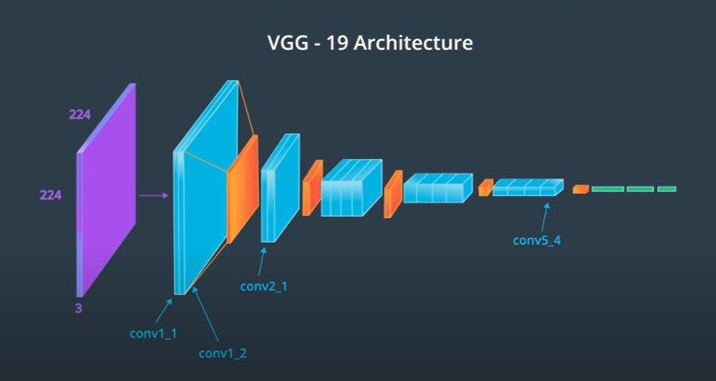
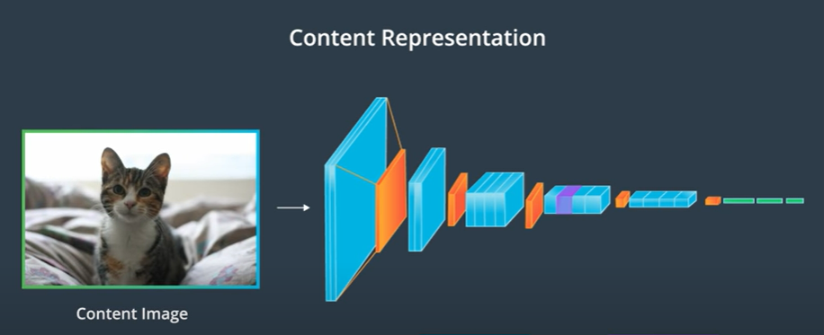
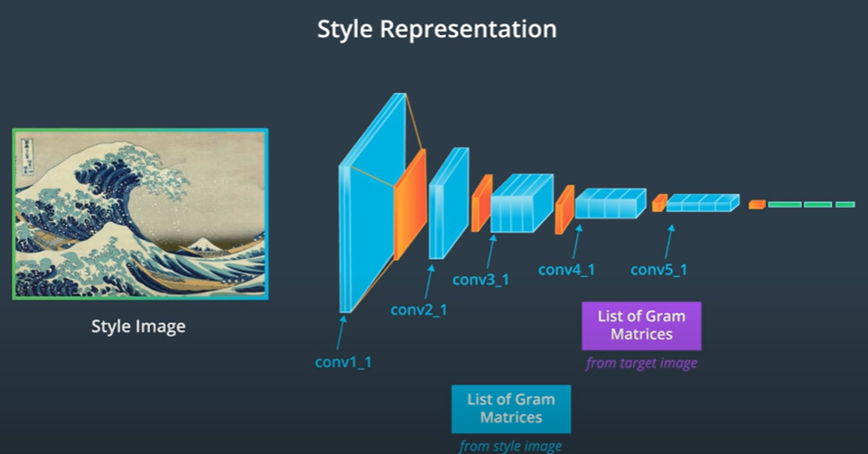
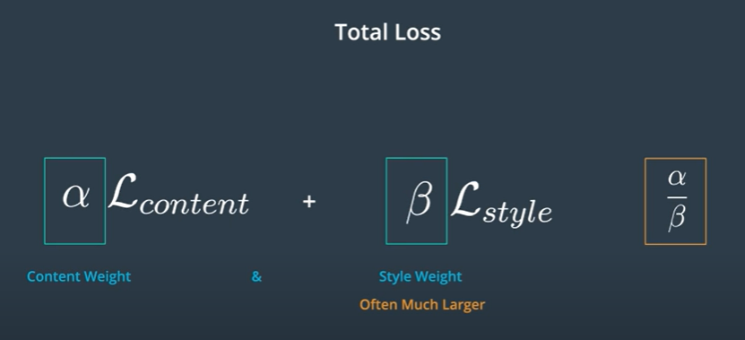

This repository is a rebuilding of a style transfer method that is outlined in this paper, [Image Style Transfer Using Convolutional Neural Networks, by Gays](https://www.cv-foundation.org/openaccess/content_cvpr_2016/papers/Gatys_Image_Style_Transfer_CVPR_2016_paper.pdf) in PyTorch.

## What is Style Transfer?

Style transfer is a computer vision technique that is used to create a stylized image by combining two images: one called a content image and the other called a style image. The output or the target image will take an object and shape arrangement from the content image, and colors and textures from the style image to form a new stylized image.

## How does Style Transfer work?

In this paper, style transfer uses the features found in the 19-layer VGG Network, which is comprised of a series of convolutional and pooling layers, and a few fully-connected layers. In the image below, the convolutional layers are named by stack and their order in the stack. Conv_1_1 is the first convolutional layer that an image is passed through, in the first stack. Conv_2_1 is the first convolutional layer in the second stack. The deepest convolutional layer in the network is conv_5_4.

The pre-trained VGG19 network is used as a feature extractor to extract content and style features from a passed in image.
To get the content and style representations of an image, we have to pass an image forward throug the VGG19 network until we get to the desired layer(s) and then get the output from that layer.

When implementing this algorithm, we define the content and the style losses and iterativly update the target image.
The content loss will be the mean squared difference between the target and content features at layer conv4_2.
The style loss is calculated in a similar way, only you have to iterate through a number of layers, specified by name in our dictionary style_weights.
Then, the total loss will be calculated by adding up the style and content losses and weighting them with a specified alpha and beta.

I used Google Colab with GPU device support to run this code. GPU hardware will accelerate the training process much faster than CPU hardware.

This repo is an implementation of Style Transfer lesson-6 from Udacity free course [Intro to Deep Learning with PyTorch](https://www.udacity.com/course/deep-learning-pytorch--ud188) 